# 留存因子终局绩效分析报告

- 因子值与前瞻 label 均由 vnpy.alpha（AlphaDataset 表达式引擎）计算
- 股票池：沪深300 历史成分股日线；label = 次日开盘价 / 当日收盘价 - 1
- 分组：每日按因子值 10 分组（qcut）；多空 = Q10 均值 − Q1 均值；年化按 244 交易日

## 因子总览

| 因子 | train RankIR | valid RankIR | test RankIR | test 多空 Sharpe |
|---|---|---|---|---|
| STRICT_CLOSE_BOARD（严格收盘封板代理） | +0.79 | +0.77 | +0.74 | 5.42 |
| FIRST_BOARD_5（近5日首板代理） | +0.75 | +0.74 | +0.72 | 4.23 |
| BOARD_CLOSE_STRENGTH（封板×日内上涨强度） | +0.71 | +0.74 | +0.72 | 5.32 |

test 段为三个因子的共同样本外确认区间，多空净值对比如下：

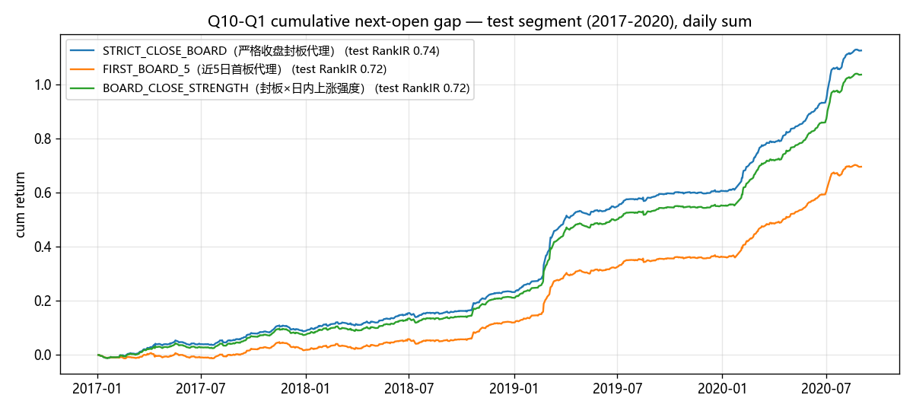

## STRICT_CLOSE_BOARD（严格收盘封板代理）（strict_close_board）

表达式：((close / ts_delay(close, 1) - 1) > 0.095) * ((close / high) > 0.9995) * ((low / close) < 0.995)

### 分段 IC 指标

| 段 | 天数 | IC | IR | RankIC | RankIR | 方向胜率 |
|---|---|---|---|---|---|---|
| train | 1702 | +0.1270 | +0.846 | +0.0609 | +0.785 | 78.74% |
| valid | 488 | +0.1348 | +0.862 | +0.0820 | +0.772 | 78.85% |
| test | 892 | +0.1302 | +0.822 | +0.0533 | +0.745 | 77.27% |

### 全样本分组与多空表现

| 指标 | 数值 |
|---|---|
| 分组平均日收益 Q1→Q10 | -0.08% / -0.10% / -0.10% / -0.10% / -0.10% / -0.10% / -0.11% / -0.10% / -0.10% / +0.05% |
| 单调性（Q 序号 Spearman） | -0.12 |
| 多空年化收益 | +30.66% |
| 多空年化波动 | +7.75% |
| 多空 Sharpe | 3.95 |
| 多空最大回撤 | -21.38% |
| 多头(Q10)年化 | +11.26% |
| 多头组日均换手率 | 17.0% |

> 成本提示：多头组日均换手 17.0%，按单边 0.1%、双边每日调仓估算，年化拖累约 +8.29%，扣除后多空年化约 +22.36%。IC 类指标 ≠ 扣费后组合收益。

### 分段多空表现

| 段 | 多空年化 | 多空波动 | 多空 Sharpe | 最大回撤 | 多头(Q10)年化 | 多头组换手 |
|---|---|---|---|---|---|---|
| train | +24.05% | +9.66% | 2.49 | -21.38% | +2.19% | 16.7% |
| valid | +55.40% | +8.28% | 6.69 | -3.86% | +26.54% | 27.6% |
| test | +30.81% | +5.68% | 5.42 | -2.22% | +14.74% | 13.2% |

### 分年 RankIC

| 年份 | RankIC |
|---|---|
| 2008 | +0.0739 |
| 2009 | +0.0760 |
| 2010 | +0.0445 |
| 2011 | +0.0432 |
| 2012 | +0.0419 |
| 2013 | +0.0628 |
| 2014 | +0.0753 |
| 2015 | +0.1182 |
| 2016 | +0.0417 |
| 2017 | +0.0448 |
| 2018 | +0.0436 |
| 2019 | +0.0548 |
| 2020 | +0.0728 |
| 2021 | +0.0727 |
| 2022 | +0.0459 |
| 2023 | +0.0409 |

**16/16 年 RankIC 为正**

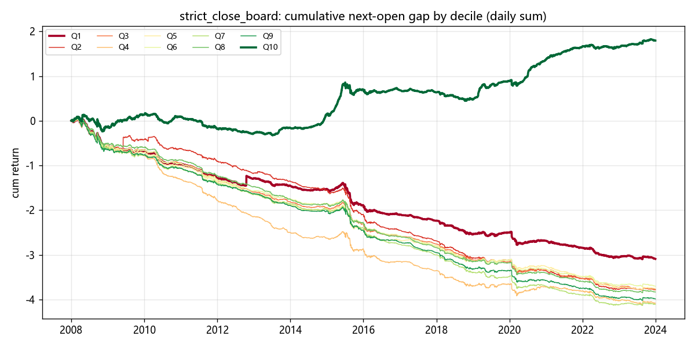

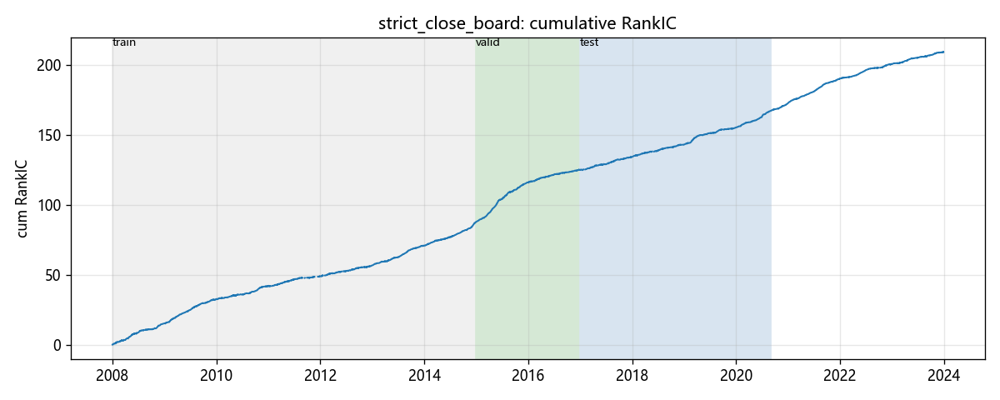

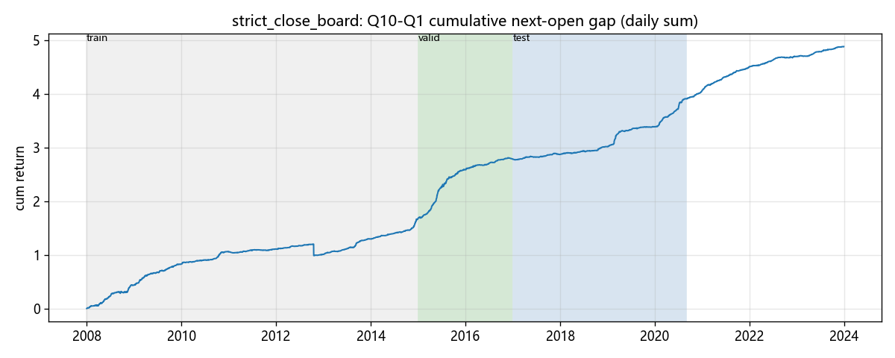

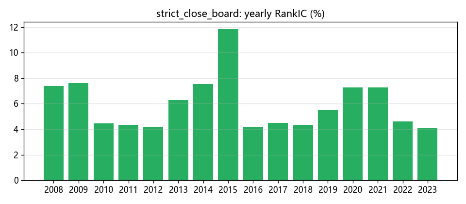

## FIRST_BOARD_5（近5日首板代理）（first_board_5）

表达式：((close / ts_delay(close, 1) - 1) > 0.095) * ((close / high) > 0.998) * ((low / close) < 0.995) * (1 - ts_max(ts_delay(((close / ts_delay(close, 1) - 1) > 0.095) * ((close / high) > 0.998), 1), 5))

### 分段 IC 指标

| 段 | 天数 | IC | IR | RankIC | RankIR | 方向胜率 |
|---|---|---|---|---|---|---|
| train | 1702 | +0.1116 | +0.803 | +0.0550 | +0.754 | 77.98% |
| valid | 488 | +0.1030 | +0.786 | +0.0669 | +0.744 | 79.22% |
| test | 892 | +0.1034 | +0.775 | +0.0463 | +0.722 | 77.25% |

### 全样本分组与多空表现

| 指标 | 数值 |
|---|---|
| 分组平均日收益 Q1→Q10 | -0.08% / -0.09% / -0.09% / -0.10% / -0.09% / -0.09% / -0.10% / -0.09% / -0.10% / +0.00% |
| 单调性（Q 序号 Spearman） | -0.08 |
| 多空年化收益 | +19.23% |
| 多空年化波动 | +7.15% |
| 多空 Sharpe | 2.69 |
| 多空最大回撤 | -21.39% |
| 多头(Q10)年化 | +0.80% |
| 多头组日均换手率 | 15.0% |

> 成本提示：多头组日均换手 15.0%，按单边 0.1%、双边每日调仓估算，年化拖累约 +7.30%，扣除后多空年化约 +11.92%。IC 类指标 ≠ 扣费后组合收益。

### 分段多空表现

| 段 | 多空年化 | 多空波动 | 多空 Sharpe | 最大回撤 | 多头(Q10)年化 | 多头组换手 |
|---|---|---|---|---|---|---|
| train | +16.74% | +9.42% | 1.78 | -21.39% | -4.52% | 15.2% |
| valid | +29.55% | +6.46% | 4.57 | -4.27% | +2.57% | 22.8% |
| test | +19.05% | +4.50% | 4.23 | -3.00% | +3.69% | 11.6% |

### 分年 RankIC

| 年份 | RankIC |
|---|---|
| 2008 | +0.0650 |
| 2009 | +0.0678 |
| 2010 | +0.0355 |
| 2011 | +0.0388 |
| 2012 | +0.0409 |
| 2013 | +0.0575 |
| 2014 | +0.0715 |
| 2015 | +0.0935 |
| 2016 | +0.0364 |
| 2017 | +0.0416 |
| 2018 | +0.0396 |
| 2019 | +0.0458 |
| 2020 | +0.0593 |
| 2021 | +0.0567 |
| 2022 | +0.0457 |
| 2023 | +0.0377 |

**16/16 年 RankIC 为正**

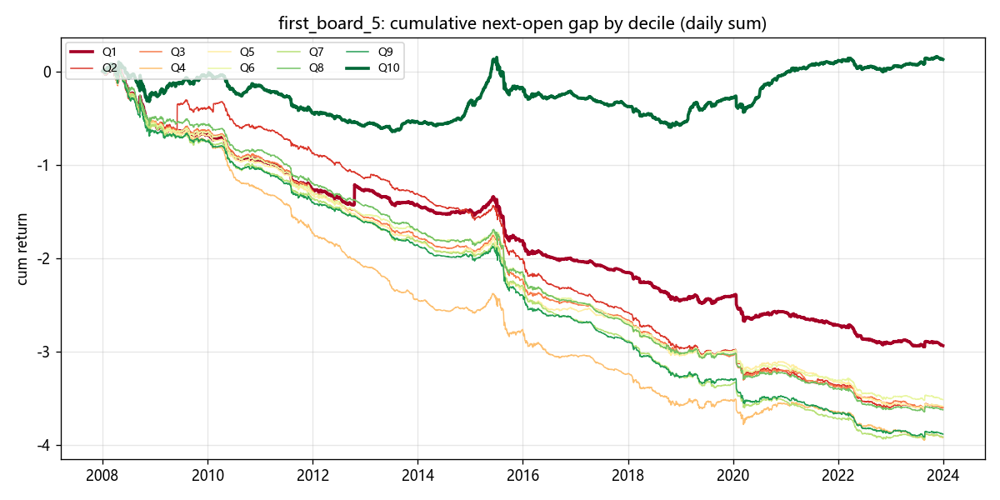

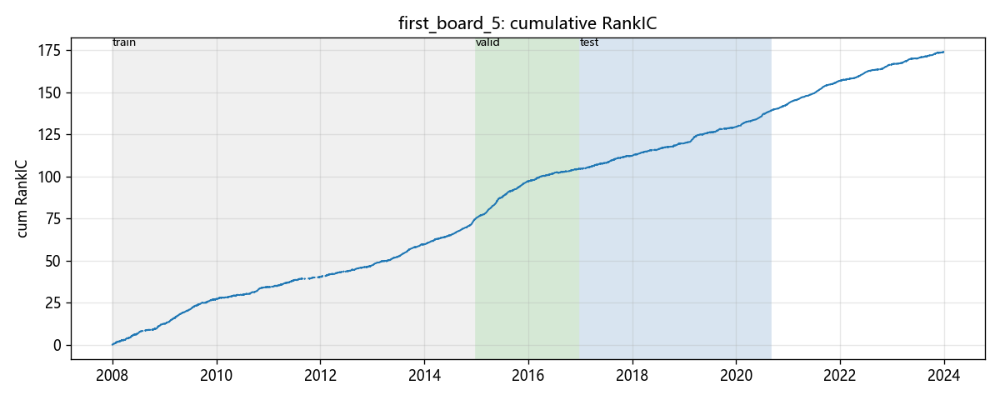

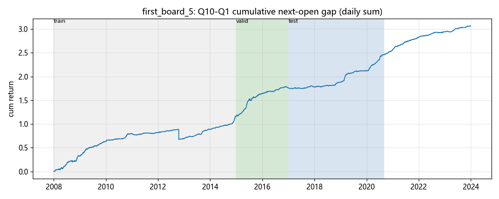

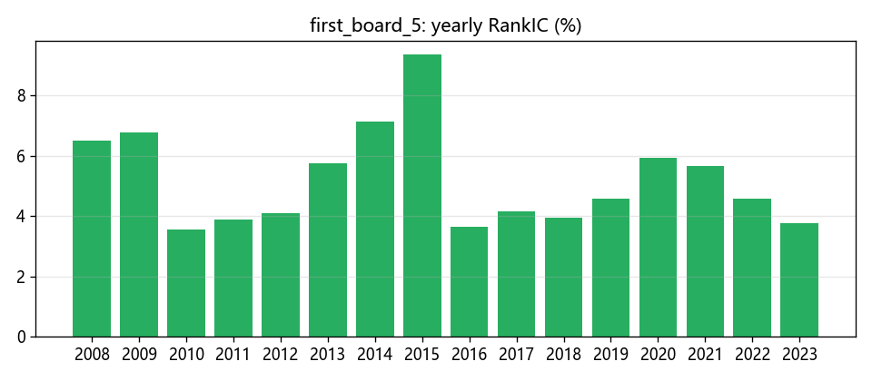

## BOARD_CLOSE_STRENGTH（封板×日内上涨强度）（board_close_strength）

表达式：((close / ts_delay(close, 1) - 1) > 0.095) * ((close / high) > 0.998) * ((low / close) < 0.995) * (close / open - 1)

### 分段 IC 指标

| 段 | 天数 | IC | IR | RankIC | RankIR | 方向胜率 |
|---|---|---|---|---|---|---|
| train | 1702 | +0.1078 | +0.760 | +0.0556 | +0.714 | 77.00% |
| valid | 488 | +0.1134 | +0.813 | +0.0761 | +0.741 | 78.67% |
| test | 892 | +0.1119 | +0.771 | +0.0504 | +0.716 | 77.95% |

### 全样本分组与多空表现

| 指标 | 数值 |
|---|---|
| 分组平均日收益 Q1→Q10 | -0.08% / -0.10% / -0.10% / -0.10% / -0.09% / -0.09% / -0.10% / -0.10% / -0.10% / +0.03% |
| 单调性（Q 序号 Spearman） | -0.12 |
| 多空年化收益 | +27.50% |
| 多空年化波动 | +7.66% |
| 多空 Sharpe | 3.59 |
| 多空最大回撤 | -21.38% |
| 多头(Q10)年化 | +8.34% |
| 多头组日均换手率 | 17.3% |

> 成本提示：多头组日均换手 17.3%，按单边 0.1%、双边每日调仓估算，年化拖累约 +8.44%，扣除后多空年化约 +19.07%。IC 类指标 ≠ 扣费后组合收益。

### 分段多空表现

| 段 | 多空年化 | 多空波动 | 多空 Sharpe | 最大回撤 | 多头(Q10)年化 | 多头组换手 |
|---|---|---|---|---|---|---|
| train | +20.94% | +9.62% | 2.18 | -21.38% | -0.63% | 17.2% |
| valid | +48.00% | +8.27% | 5.81 | -7.45% | +19.38% | 28.1% |
| test | +28.37% | +5.33% | 5.32 | -2.39% | +12.54% | 13.3% |

### 分年 RankIC

| 年份 | RankIC |
|---|---|
| 2008 | +0.0636 |
| 2009 | +0.0692 |
| 2010 | +0.0401 |
| 2011 | +0.0389 |
| 2012 | +0.0376 |
| 2013 | +0.0606 |
| 2014 | +0.0709 |
| 2015 | +0.1100 |
| 2016 | +0.0383 |
| 2017 | +0.0410 |
| 2018 | +0.0415 |
| 2019 | +0.0513 |
| 2020 | +0.0700 |
| 2021 | +0.0693 |
| 2022 | +0.0445 |
| 2023 | +0.0404 |

**16/16 年 RankIC 为正**

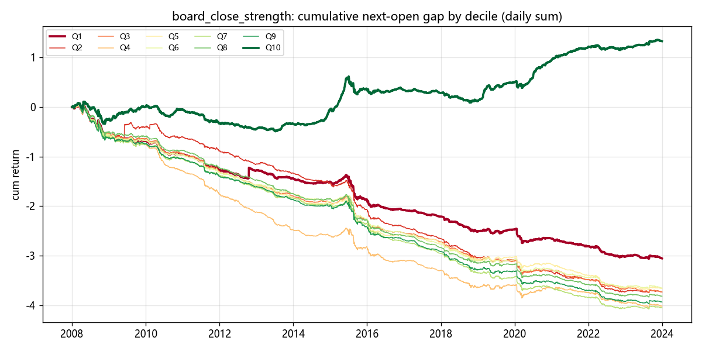

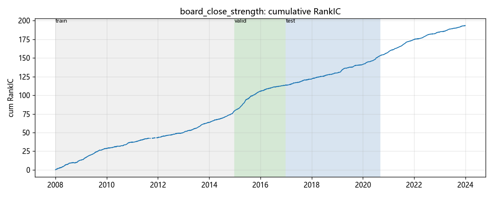

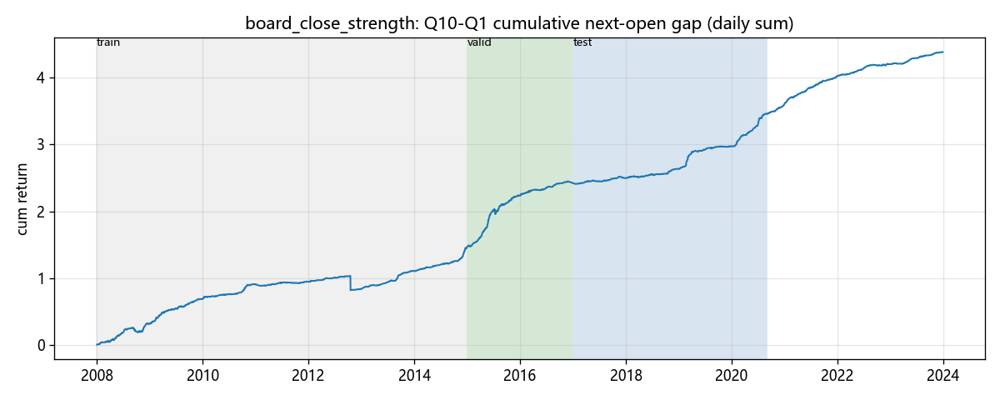

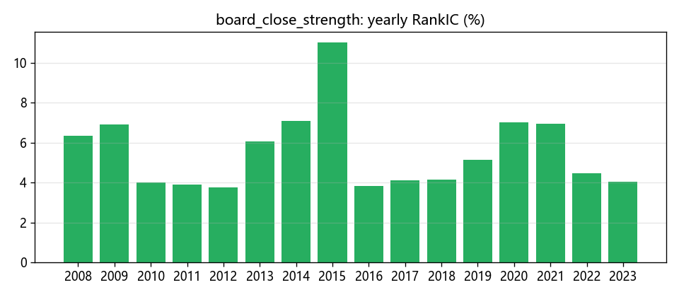
